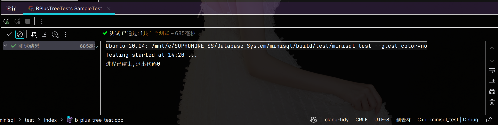
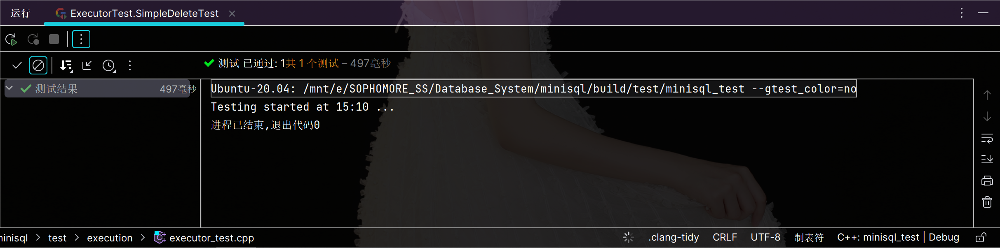
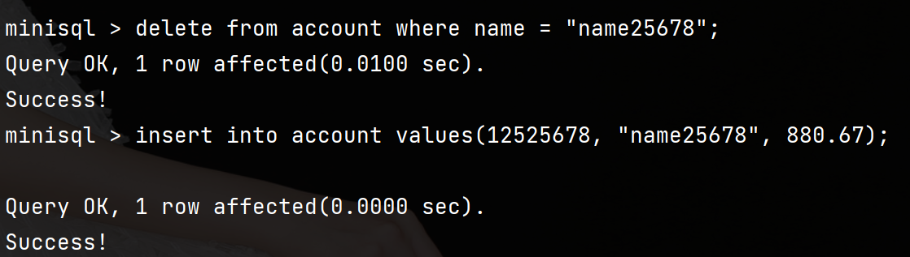

<div class="cover" style="page-break-after:always;font-family:方正公文仿宋;width:100%;height:100%;border:none;margin: 0 auto;text-align:center;">
    <div style="width:60%;margin: 0 auto;height:0;padding-bottom:10%;">
        </br>
        
    </div>
    </br></br></br></br></br>
    <div style="width:60%;margin: 0 auto;height:0;padding-bottom:40%;">
        
	</div>
    </br></br></br></br></br></br></br></br>
    <span style="font-family:华文黑体Bold;text-align:center;font-size:20pt;margin: 10pt auto;line-height:30pt;">数据库系统: PROJECT</span>
    <p style="text-align:center;font-size:14pt;margin: 0 auto"> </p>
    </br>
    </br>
    <table style="border:none;text-align:center;width:72%;font-family:仿宋;font-size:14px; margin: 0 auto;">
    <tbody style="font-family:方正公文仿宋;font-size:12pt;">
    	<tr style="font-weight:normal;"> 
    		<td style="width:20%;text-align:right;">题　　目</td>
    		<td style="width:2%">：</td> 
    		<td style="width:40%;font-weight:normal;border-bottom: 1px solid;text-align:center;font-family:华文仿宋"> MiniSQL</td>     </tr>
    	<tr style="font-weight:normal;"> 
    		<td style="width:20%;text-align:right;">授课教师</td>
    		<td style="width:2%">：</td> 
    		<td style="width:40%;font-weight:normal;border-bottom: 1px solid;text-align:center;font-family:华文仿宋">周波 </td>     </tr>
    	<tr style="font-weight:normal;"> 
    		<td style="width:20%;text-align:right;">姓　　名</td>
    		<td style="width:2%">：</td> 
    		<td style="width:40%;font-weight:normal;border-bottom: 1px solid;text-align:center;font-family:华文仿宋"> 王伟杰</td>     </tr>
    	<tr style="font-weight:normal;"> 
    		<td style="width:20%;text-align:right;">学　　号</td>
    		<td style="width:2%">：</td> 
    		<td style="width:40%;font-weight:normal;border-bottom: 1px solid;text-align:center;font-family:华文仿宋">3210106034 </td>     </tr>
    	<tr style="font-weight:normal;"> 
    		<td style="width:20%;text-align:right;">日　　期</td>
    		<td style="width:2%">：</td> 
    		<td style="width:40%;font-weight:normal;border-bottom: 1px solid;text-align:center;font-family:华文仿宋">2023-06-21</td>     </tr>
    </tbody>              
    </table>
</div>


<center><div style='height:15mm;'></div><div style="font-family:Times New Roman;font-size:20pt;"> 目录</div></center><br><br>

[toc]

<div STYLE="page-break-after: always;"></div>

## 实验目的

1. 设计并实现一个精简型单用户SQL引擎MiniSQL，允许用户通过字符界面输入SQL语句实现基本的增删改查操作，并能够通过索引来优化性能。
2. 通过对MiniSQL的设计与实现，提高学生的系统编程能力，加深对数据库管理系统底层设计的理解。

## 实验需求

1. 数据类型：要求支持三种基本数据类型：`integer`，`char(n)`，`float`。
2. 表定义：一个表可以定义多达32个属性，各属性可以指定是否为`unique`，支持单属性的主键定义。
3. 索引定义：对于表的主属性自动建立B+树索引，对于声明为`unique`的属性也需要建立B+树索引。
4. 数据操作: 可以通过`and`或`or`连接的多个条件进行查询，支持等值查询和区间查询。支持每次一条记录的插入操作；支持每次一条或多条记录的删除操作。
5. 在工程实现上，使用源代码管理工具（如Git）进行代码管理，代码提交历史和每次提交的信息清晰明确；同时编写的代码应符合代码规范，具有良好的代码风格。

## 实验平台

### 代码框架

本实验基于CMU-15445 BusTub框架，课程组做了一些修改和扩展。

### 编译&开发环境

>  使用WSL-Ubuntu + CLion进行开发

- `gcc`&`g++` : 8.0+ (Linux)，使用`gcc --version`和`g++ --version`查看

    

- `cmake`: 3.16+ (Both)，使用`cmake --version`查看

    

- `gdb`: 7.0+ (Optional)，使用`gdb --version`查看

    

- `flex`& `bison`(暂时不需要安装，但如果需要对SQL编译器的语法进行修改，需要安装）

CLion配置：


## 实验模块

### DISK AND BUFFER POOL MANAGER

#### 概述

第一个模块包含了四个部分，分别是

- 位图页实现
- 磁盘数据页管理
- 缓冲池替换策略
    - LRU替换策略
    - **(Bonus)** CLOCK替换策略
- 缓冲池管理

#### Bitmap 实现

​	位图页是Disk Manager模块中的一部分，是实现磁盘页分配与回收工作的必要功能组件。位图页与数据页一样，占用`PAGE_SIZE`（4KB）的空间，标记一段连续页的分配情况。

​	Bitmap Page由两部分组成，一部分是用于加速Bitmap内部查找的元信息（Bitmap Page Meta），它包含当前已经分配的页的数量（`page_allocated_`）以及下一个空闲的数据页(`next_free_page_`)。除去元信息外，页中剩余的部分就是Bitmap存储的具体数据，其大小`BITMAP_CONTENT_SIZE`可以通过`PAGE_SIZE - BITMAP_PAGE_META_SIZE`来计算，自然而然，这个Bitmap Page能够支持最多纪录`BITMAP_CONTENT_SIZE * 8`个连续页的分配情况。

​	下面是我实现的函数的思路：

1. `bool BitmapPage<PageSize>::AllocatePage(uint32_t &page_offset)`
    - 该函数用于分配一个页面，并将其页面偏移量存储在`page_offset`参数中。
    - 首先检查下一个空闲页面的索引是否已达到支持的最大页面数，或者下一个空闲页面是否不为空闲页面，如果是，则返回false表示无法分配页面。
    - 如果可以分配页面，则增加已分配页面的计数（`page_allocated_`）。
    - 根据下一个空闲页面的索引，计算所在字节和位的索引，然后将对应的位设置为1，表示该页面已被分配。
    - 接着，从下一个空闲页面的索引开始，遍历之后的页面，找到下一个空闲页面的索引并更新`next_free_page_`。
    - 最后，返回true表示成功分配页面。
2. `bool BitmapPage<PageSize>::DeAllocatePage(uint32_t page_offset)`
    - 该函数用于释放给定页面的分配。
    - 首先根据页面偏移量计算所在字节和位的索引。
    - 如果给定的页面是空闲页面，则返回false表示无法释放页面。
    - 否则，减少已分配页面的计数。
    - 将对应的位设置为0，表示该页面已被释放。
    - 如果释放的页面的索引小于`next_free_page_`，则更新`next_free_page_`为该索引。
    - 最后，返回true表示成功释放页面。
3. `bool BitmapPage<PageSize>::IsPageFree(uint32_t page_offset) const`
    - 该函数用于检查给定页面是否是空闲页面。
    - 首先根据页面偏移量计算所在字节和位的索引。
    - 判断对应位是否为0，如果是，则表示该页面是空闲页面，返回true；否则返回false。
4. `bool BitmapPage<PageSize>::IsPageFreeLow(uint32_t byte_index, uint8_t bit_index) const`
    - 该函数用于在低级函数中检查给定页面是否是空闲页面。
    - 根据给定的字节索引和位索引，判断对应位是否为0，如果是，则表示该页面是空闲页面，返回true；否则返回false。

​	测试结果：


#### 磁盘数据页管理

​	在实现了基本的位图页后，我们就可以通过一个位图页加上一段连续的数据页（数据页的数量取决于位图页最大能够支持的比特数）来对磁盘文件（DB File）中数据页进行分配和回收。但实际上，这样的设计还存在着一点点的小问题，假设数据页的大小为4KB，一个位图页中的每个字节都用于记录，那么这个位图页最多能够管理32768个数据页，也就是说，这个文件最多只能存储`4K * 8 * 4KB = 128MB`的数据，这实际上很容易发生数据溢出的情况。

​	为了应对上述问题，一个简单的解决思路是，把上面说的一个位图页加一段连续的数据页看成数据库文件中的一个分区（Extent），再通过一个额外的元信息页来记录这些分区的信息。

​	下面是我实现的函数的思路：

1. `page_id_t DiskManager::AllocatePage()`
    - 该函数用于分配一个页面，并返回其逻辑页面ID。
    - 首先，获取磁盘文件的元数据页（`meta_data_`）。
    - 声明一个缓冲区（`buffer`）用于读取和写入页面数据。
    - 在元数据页中查找可用的扩展（extent），即扩展中还有可分配的页面。
    - 如果找到了可用的扩展，则读取对应的位图页（`BitmapPage`），并在该位图页中分配一个页面。
    - 如果没有找到可用的扩展，则创建一个新的扩展和位图页，并分配其中的第一个页面。
    - 最后，更新元数据页的相关统计信息，并将更新后的位图页写回磁盘。
    - 返回分配的页面的逻辑页面ID。
2. `void DiskManager::DeAllocatePage(page_id_t logical_page_id)`
    - 该函数用于释放给定逻辑页面ID对应的页面。
    - 首先，检查给定页面是否是空闲页面，如果是，则直接返回。
    - 获取磁盘文件的元数据页（`meta_data_`）。
    - 声明一个缓冲区（`buffer`）用于读取和写入页面数据。
    - 根据逻辑页面ID计算所在扩展和位图页的索引。
    - 读取对应的位图页，并在该位图页中释放指定页面。
    - 更新元数据页的相关统计信息，并将更新后的位图页写回磁盘。
3. `bool DiskManager::IsPageFree(page_id_t logical_page_id)`
    - 该函数用于检查给定逻辑页面ID对应的页面是否是空闲页面。
    - 声明一个缓冲区（`buffer`）用于读取页面数据。
    - 根据逻辑页面ID计算所在扩展和位图页的索引。
    - 读取对应的位图页，并调用位图页的`IsPageFree`函数来检查页面是否空闲。
4. `page_id_t DiskManager::MapPageId(page_id_t logical_page_id)`
    - 该函数用于将逻辑页面ID映射为物理页面ID。
    - 根据逻辑页面ID计算物理页面ID，并返回映射结果。

​	测试结果：


#### 缓冲区替换策略

##### LRU替换策略

​	LRU 替换策略是最近最少访问者被替换，我的实现方式是用一个链表记录 frame_id ，用哈希表记录 frame_id 在链表中的位置。效果类似于一个队列，每次 Unpin 时，从链表末尾加入，每次寻找 Victim 时，则从链表头取出。

​	下面是我实现的函数的思路：

1. `bool LRUReplacer::Victim(frame_id_t *frame_id)`
   - 该函数用于选择一个需要替换的页面，并将其对应的帧ID存储在`frame_id`中。
   - 首先，检查LRU列表是否为空，如果为空，则表示没有可替换的页面，返回false。
   - 从LRU列表的前面取出第一个帧ID，然后将其从LRU列表中移除。
   - 在LRU映射表中查找该帧ID，如果找到，则将其从映射表中删除，并将帧ID存储在`frame_id`中，然后返回true。
   - 如果在映射表中找不到该帧ID，则表示存在逻辑错误，返回false。

2. `void LRUReplacer::Pin(frame_id_t frame_id)`
   - 该函数用于将指定帧ID对应的页面标记为固定（Pinned）状态，表示不可替换。
   - 首先，在LRU映射表中查找该帧ID。
   - 如果找到该帧ID，则从LRU列表中移除对应的迭代器，并将其从映射表中删除。

3. `void LRUReplacer::Unpin(frame_id_t frame_id)`
   - 该函数用于将指定帧ID对应的页面标记为非固定（Unpinned）状态，表示可替换。
   - 首先，检查LRU映射表的大小是否达到了最大页面数，如果达到了，则无需进行操作，直接返回。
   - 在LRU映射表中查找该帧ID。
   - 如果找不到该帧ID，则表示该页面不在LRU列表中，将其添加到LRU列表的末尾，并在LRU映射表中创建对应的映射关系。
   - 注意：在实现LRU算法时，页面的插入位置是在列表的末尾。

4. `size_t LRUReplacer::Size()`
   - 该函数用于获取当前LRU替换器中的页面数量。
   - 直接返回LRU映射表的大小即可。

​	测试结果：


##### Bonus: CLOCK替换策略

​	Clock 替换策略是一种较为开销较低的替换策略，通过给予每个数据页“第二次机会”来实现页面的替换。对每个数据页来说，一共设置两种状态，ACCESSED(True) 和 UNUSED(False)，使用`clock_status`判断。对于初次加入 Clock Replacer 的页面，设置为 ACCESSED，在寻找待替换页面时，先遍历一遍 `clock_status`，将 ACCESSED 设置为 UNUSED，同时将待替换的页面设置为第一个遇到的 UNUSED 页面。

​	下面是我实现的函数的思路：

1. `CLOCKReplacer::CLOCKReplacer(size_t num_pages)`
    - 构造函数，用于初始化CLOCK替换器。
    - 首先，创建一个`pair`类型的`clock_item`，用于表示每个页面的CLOCK状态。
    - 然后，根据`num_pages`的值，将`clock_item`添加到`clock_status`向量中，表示每个页面的初始状态都为（true, false）。
    - 将`clock_hand`初始化为0，表示CLOCK指针的初始位置。
    - 将`capacity`初始化为0，表示当前替换器中可替换的页面数量。
2. `CLOCKReplacer::~CLOCKReplacer()`
    - 析构函数，默认实现。
3. `bool CLOCKReplacer::Victim(frame_id_t *frame_id)`
    - 选择一个需要替换的页面，并将其对应的帧ID存储在`frame_id`中。
    - 使用循环来遍历页面，直到找到一个可替换的页面或所有页面都被固定为止。
    - 如果CLOCK指针超出了`clock_status`的范围，将其重置为0，以实现循环遍历。
    - 如果当前页面的CLOCK状态为true，表示该页面被访问过，将CLOCK指针后移一位。
    - 如果当前页面的CLOCK状态为false，且第二次机会位为false，表示该页面是可替换的页面。
        - 将该页面的CLOCK状态设置为true，表示页面已经被访问过。
        - 减少`capacity`计数器的值，表示找到了一个可替换的页面。
        - 将该页面的帧ID存储在`frame_id`中，然后将CLOCK指针后移一位，并返回true。
    - 如果所有页面都被固定，返回false。
4. `void CLOCKReplacer::Pin(frame_id_t frame_id)`
    - 将指定帧ID对应的页面标记为固定（Pinned）状态，表示不可替换。
    - 首先，检查该页面的CLOCK状态是否为false。
    - 如果CLOCK状态为false，将其设置为true，并减少`capacity`计数器的值。
5. `void CLOCKReplacer::Unpin(frame_id_t frame_id)`
    - 将指定帧ID对应的页面标记为非固定（Unpinned）状态，表示可替换。
    - 首先，检查该页面的CLOCK状态是否为true。
    - 如果CLOCK状态为true，将其设置为false，并将第二次机会位设置为true。
    - 增加`capacity`计数器的值，表示可替换的页面数量增加。
6. `size_t CLOCKReplacer::Size()`
    - 获取当前CLOCK替换器中可替换的页面数量，即`capacity`的值。

​	测试结果：


#### 缓冲池管理

​	Buffer Pool Manager负责从Disk Manager中获取数据页并将它们存储在内存中，并在必要时将脏页面转储到磁盘中（如需要为新的页面腾出空间）。

​	下面是我实现的函数的思路：

1. `BufferPoolManager::BufferPoolManager(size_t pool_size, DiskManager *disk_manager)`
    - 构造函数，用于初始化缓冲池管理器。
    - 创建一个指定大小的页面数组`pages_`，用于存储页面数据。
    - 根据`pool_size`的值，初始化空闲列表`free_list_`，将页面的索引添加到列表中。
    - 选择一个页面替换器（replacer），在这里可以选择使用LRUReplacer或CLOCKReplacer。
    - 初始化其他成员变量。
2. `BufferPoolManager::~BufferPoolManager()`
    - 析构函数，用于释放资源。
    - 首先，将所有页面刷新到磁盘上。
    - 删除页面数组`pages_`和页面替换器`replacer_`的内存空间。
3. `Page *BufferPoolManager::FetchPage(page_id_t page_id)`
    - 获取指定页面ID对应的页面。
    - 首先，在页表中查找请求的页面（P）。
        - 如果找到了页面P，将其固定（pin）并立即返回。
        - 如果页面P不存在，需要找到一个替换页面（R）。
            - 首先从空闲列表中查找可用页面。
            - 如果空闲列表为空，则从页面替换器中选择一个替换页面R。
        - 如果找不到可用页面，则返回nullptr。
    - 如果替换页面R是脏页面，则将其刷新到磁盘。
    - 从页表中删除替换页面R，并将请求页面P插入到页表中。
    - 更新页面P的元数据，从磁盘读取页面内容，并返回指向页面P的指针。
4. `Page *BufferPoolManager::NewPage(page_id_t &page_id)`
    - 创建一个新的页面。
    - 首先，检查缓冲池中是否存在可用的空闲页面。
    - 如果所有页面都被固定，则返回nullptr。
    - 从空闲列表中选择一个空闲页面或者从页面替换器中选择一个替换页面P。
    - 如果找不到可用页面，则返回nullptr。
    - 如果替换页面P是脏页面，则将其刷新到磁盘。
    - 调用AllocatePage()函数分配一个新的页面ID。
    - 从页表中删除替换页面P，并将新页面插入到页表中。
    - 更新新页面的元数据，清除页面内容，并将其固定。
    - 将新页面的ID设置为输出参数`page_id`，并返回指向新页面的指针。
5. `bool BufferPoolManager::DeletePage(page_id_t page_id)`
    - 删除指定页面ID对应的页面。
    - 首先，调用DeallocatePage()函数释放页面ID。
    - 在页表中查找请求的页面（P）。
        - 如果页面P不存在，则返回true。
        - 如果页面P存在但被固定（pin count不为零），则返回false，表示有其他用户正在使用该页面。
    - 如果可以删除页面P，则从页表中删除页面P，并将其元数据重置，并将其添加到空闲列表中。
    - 最后，将页面P的固定计数设置为零，并从页面替换器中取消固定。
    - 返回true表示删除成功。
6. `bool BufferPoolManager::UnpinPage(page_id_t page_id, bool is_dirty)`
    - 解固定指定页面ID对应的页面。
    - 在页表中查找请求的页面（P）。
        - 如果页面P不存在，则返回true。
    - 如果页面P的固定计数为零，则返回false。
    - 如果指定了页面为脏页面，则将页面P标记为脏。
    - 将页面P的固定计数减一。
    - 如果页面P的固定计数为零，则从页面替换器中取消固定。
    - 返回true表示解固定成功。
7. `bool BufferPoolManager::FlushPage(page_id_t page_id)`
    - 将指定页面ID对应的页面刷新到磁盘。
    - 在页表中查找请求的页面（P）。
        - 如果页面P不存在，则返回false。
    - 获取页面P的索引（frame_id）。
    - 调用磁盘管理器的WritePage()函数，将页面P的数据写入磁盘。
    - 将页面P的脏标记设置为false。
    - 返回true表示刷新成功。
8. `page_id_t BufferPoolManager::AllocatePage()`
    - 分配一个新的页面ID。
    - 调用磁盘管理器的AllocatePage()函数分配一个新的页面ID，并返回该ID。
9. `void BufferPoolManager::DeallocatePage(__attribute__((unused)) page_id_t page_id)`
    - 释放指定的页面ID。
    - 调用磁盘管理器的DeallocatePage()函数释放页面ID。
10. `bool BufferPoolManager::IsPageFree(page_id_t page_id)`
    - 检查指定页面ID对应的页面是否为空闲页面。
    - 调用磁盘管理器的IsPageFree()函数检查页面ID是否为空闲页面，并返回结果。
11. `bool BufferPoolManager::CheckAllUnpinned()`
    - 仅用于调试，检查所有页面是否已解固定。
    - 遍历页面数组，如果存在固定计数不为零的页面，则打印出错误信息，并返回false。
    - 如果所有页面的固定计数都为零，则返回true。
12. `frame_id_t BufferPoolManager::TryToFindFreePage()`
    - 尝试找到一个空闲页面。
    - 首先，从空闲列表中选择一个空闲页面。
    - 如果空闲列表为空，则从页面替换器中选择一个替换页面。
    - 如果找不到可用页面，则返回INVALID_PAGE_ID。

​	测试结果：


### RECORD MANAGER

#### 概述

​	在MiniSQL的设计中，Record Manager负责管理数据表中所有的记录，它能够支持记录的插入、删除与查找操作，并对外提供相应的接口。

​	与记录（Record）相关的概念有以下几个：

- 列（`Column`）：在`src/include/record/column.h`中被定义，用于定义和表示数据表中的某一个字段，即包含了这个字段的字段名、字段类型、是否唯一等等；
- 模式（`Schema`）：在`src/include/record/schema.h`中被定义，用于表示一个数据表或是一个索引的结构。一个`Schema`由一个或多个的`Column`构成；
- 域（`Field`）：在`src/include/record/field.h`中被定义，它对应于一条记录中某一个字段的数据信息，如存储数据的数据类型，是否是空，存储数据的值等等；
- 行（`Row`）：在`src/include/record/row.h`中被定义，与元组的概念等价，用于存储记录或索引键，一个`Row`由一个或多个`Field`构成。

​	此外，与数据类型相关的定义和实现位于`src/include/record/types.h`中。

#### 记录与模式

​	这部分我主要实现的是序列化和反序列化。

​	为了持久化数据，我们需要对 Row，Column，Schema 和 Field 进行序列化处理，以便它能够存到磁盘中。此外引入魔数做为简单的检验数据正确性的手段。 

​	序列化也即在上游像“水流”一样将数据按字节存到一块连续的内存区域（buffer）中，反序列化即在“下游”从 buffer 中按顺序取出存的东西再重新构造出相应的对象。

##### Row

序列化：

- 首先，函数会进行两个断言检查：
    - 检查传入的 schema 是否为有效指针。
    - 检查 schema 中的列数是否与行对象中的字段数相等。
- 函数定义一个变量 `result`，用于记录序列化后的总字节数。
- 接下来，函数将 ROW_MAGIC_NUM（一个特定的数字）写入到 buf 中，并将 buf 指针向后移动 `sizeof(uint32_t)` 字节。同时，result 加上 `sizeof(uint32_t)` 字节。
- 接着，函数定义了一个无符号整型变量 `bitmap`，用于记录每个字段是否为 null 的信息。然后遍历行对象的字段集合。
    - 对于每个字段，如果该字段为 null，则将 bitmap 的第 i 位设置为 1，否则设置为 0。并将 i 加 1。
- 将 `bitmap` 的值写入到 buf 中，并将 buf 指针向后移动 `sizeof(unsigned int)` 字节。同时，result 加上 `sizeof(unsigned int)` 字节。
- 接下来，函数再次遍历行对象的字段集合，对于每个字段，调用其 `SerializeTo` 方法将字段序列化到 buf 中，并将 buf 指针向后移动序列化后的字节数。同时，result 加上序列化后的字节数。
- 最后，函数返回 result，表示序列化后的总字节数。

反序列化：

- 首先，函数会进行两个断言检查：
    - 检查传入的 schema 是否为有效指针。
    - 检查行对象的字段集合是否为空。
- 函数定义一个变量 `result`，用于记录反序列化后的总字节数。
- 函数从 buf 中读取一个 uint32_t 类型的值，并将 buf 指针向后移动 `sizeof(uint32_t)` 字节。同时，result 加上 `sizeof(uint32_t)` 字节。
- 如果读取的 magic_num 不等于 ROW_MAGIC_NUM，则返回 0，表示反序列化失败。
- 接下来，函数从 schema 中获取列数，并调整行对象的字段集合大小为获取到的列数。
- 然后，函数从 buf 中读取一个 unsigned int 类型的值，并将 buf 指针向后移动 `sizeof(unsigned int)` 字节。同时，result 加上 `sizeof(unsigned int)` 字节。
- 函数获取 key_schema 中的列集合，并遍历这些列。
    - 对于每个列，函数从 schema 中获取对应列的索引，并根据 bitmap 中的相应位的值，调用 `Field::DeserializeFrom` 方法将字段从 buf 中反序列化到 fields_ 中的相应位置。然后将 buf 指针向后移动序列化后的字节数。同时，result 加上序列化后的字节数。
- 最后，函数返回 result，表示序列化后的总字节数。

##### Column

序列化：

- 首先，定义一个偏移量（ofs）为0，用于记录序列化的位置。
- 写入魔术数（magic number）到缓冲区中，将ofs增加sizeof(uint32_t)。
- 将列名的长度写入缓冲区中，将ofs增加sizeof(uint32_t)。
- 将列名的字符数组（以C字符串形式）写入缓冲区中，将ofs增加列名的长度。
- 将列类型（type_）写入缓冲区中，将ofs增加sizeof(TypeId)。
- 将列长度（len_）写入缓冲区中，将ofs增加sizeof(uint32_t)。
- 将列索引（table_ind_）写入缓冲区中，将ofs增加sizeof(uint32_t)。
- 将可空性（nullable_）写入缓冲区中，将ofs增加sizeof(bool)。
- 将唯一性（unique_）写入缓冲区中，将ofs增加sizeof(bool)。
- 返回ofs作为序列化后的数据长度。

反序列化：

- 首先，检查传入的Column指针是否为nullptr，如果不为nullptr，则输出警告信息。
- 从缓冲区中读取魔术数（magic number），将ofs增加sizeof(uint32_t)。
- 检查读取的魔术数是否与预期的值相等，如果不相等，则输出警告信息。
- 从缓冲区中读取列名的长度，将ofs增加sizeof(uint32_t)。
- 从缓冲区中读取列名的字符数组，并构造一个std::string对象。
- 从缓冲区中读取列类型（type_），将ofs增加sizeof(TypeId)。
- 从缓冲区中读取列长度（len_），将ofs增加sizeof(uint32_t)。
- 从缓冲区中读取列索引（table_ind_），将ofs增加sizeof(uint32_t)。
- 从缓冲区中读取可空性（nullable_），将ofs增加sizeof(bool)。
- 从缓冲区中读取唯一性（unique_），将ofs增加sizeof(bool)。
- 根据列类型（type_）的值，动态分配一个新的Column对象，并传入解析出的数据成员进行构造。
- 返回ofs作为解析后的数据长度。

##### Schema

序列化：

- 首先，定义一个偏移量（ofs）为0，用于记录序列化的位置。
- 将魔术数（magic number）写入缓冲区，将ofs增加sizeof(uint32_t)。
- 将列的数量写入缓冲区，将ofs增加sizeof(uint32_t)。
- 遍历所有的列（columns_）：
    - 调用每个列的SerializeTo方法，并将结果写入缓冲区，将ofs增加列的序列化长度。
- 返回ofs作为序列化后的数据长度。

反序列化：

- 首先，定义一个偏移量（ofs）为0，用于记录反序列化的位置。
- 从缓冲区中读取魔术数（magic number），将ofs增加sizeof(uint32_t)。
- 检查读取的魔术数是否与预期的值相等，如果不相等，则抛出异常。
- 从缓冲区中读取列的数量，将ofs增加sizeof(uint32_t)。
- 创建一个空的列向量（columns）用于存储反序列化后的列对象。
- 使用循环读取每个列的数据：
    - 创建一个临时的Column指针（temp）并初始化为nullptr。
    - 调用Column类的DeserializeFrom方法解析列数据，并将解析结果赋值给temp，同时将ofs增加解析的数据长度。
    - 将temp添加到列向量中。
- 使用列向量创建一个新的Schema对象（schema）。
- 返回ofs作为反序列化后的数据长度。


测试结果：


#### 堆表的实现

​	堆表的数据结构和教材上的基本一致，由表头、空闲空间和已经插入数据三部分组成。在这部分我们需要完成的函数有：

- `TableHeap:InsertTuple(&row, *txn)`: 向堆表中插入一条记录，插入记录后生成的`RowId`需要通过`row`对象返回（即`row.rid_`）；
- `TableHeap:UpdateTuple(&new_row, &rid, *txn)`：将`RowId`为`rid`的记录`old_row`替换成新的记录`new_row`，并将`new_row`的`RowId`通过`new_row.rid_`返回；
- `TableHeap:ApplyDelete(&rid, *txn)`：从物理意义上删除这条记录；
- `TableHeap:GetTuple(*row, *txn)`：获取`RowId`为`row->rid_`的记录；
- `TableHeap:FreeHeap()`：销毁整个`TableHeap`并释放这些数据页；
- `TableHeap::Begin()`：获取堆表的首迭代器；
- `TableHeap::End()`：获取堆表的尾迭代器；
- `TableIterator`类中的成员操作符

- - `TableIterator::operator++()`：移动到下一条记录，通过`++iter`调用；
    - `TableIterator::operator++(int)`：移动到下一条记录，通过`iter++`调用；

​	测试结果：


### INDEX MANAGER

#### 概述

​	Index Manager 负责数据表索引的实现和管理，包括：索引的创建和删除，索引键的等值查找，索引键的范围查找（返回对应的迭代器），以及插入和删除键值等操作，并对外提供相应的接口。

​	通过遍历堆表的方式来查找一条记录是十分低效的，为了能够快速定位到某条记录而无需搜索数据表中的每一条记录，我们需要在上一个实验的基础上实现一个索引，这能够为快速随机查找和高效访问有序记录提供基础。索引有很多种实现方式，如B+树索引，Hash索引等等。在本模块中，我实现了一个基于磁盘的B+树动态索引结构。

#### B+树数据页

​	`	BPlusTreePage`是`BPlusTreeInternalPage`和`BPlusTreeLeafPage`类的公共父类，它包含了中间结点和叶子结点共同需要的数据：

- `page_type_`: 标记数据页是中间结点还是叶子结点；
- `key_size_`: 当前索引键的长度，
- `lsn_`: 数据页的日志序列号，目前不会用到，如果之后感兴趣做Crash Recovery相关的内容需要用到；
- `size_`: 当前结点中存储Key-Value键值对的数量；
- `max_size_`: 当前结点最多能够容纳Key-Value键值对的数量；
- `parent_page_id_`: 父结点对应数据页的`page_id`;
- `page_id_`: 当前结点对应数据页的`page_id`。

​	中间结点`BPlusTreeInternalPage`不存储实际的数据，它只按照顺序存储$m$个键和$m+1$个指针（这些指针记录的是子结点的`page_id`）。由于键和指针的数量不相等，因此我需要将第一个键设置为INVALID，也就是说，顺序查找时需要从第二个键开始查找。在任何时候，每个中间结点至少是半满的（Half Full）。当删除操作导致某个结点不满足半满的条件，需要通过合并（Merge）相邻两个结点或是从另一个结点中借用（移动）一个元素到该结点中（Redistribute)来使该结点满足半满的条件。当插入操作导致某个结点溢出时，需要将这个结点分裂成为两个结点。

​	叶结点`BPlusTreeLeafPage`存储实际的数据，它按照顺序存储$m$个键和$m$个值，其中键由一个或多个`Field`序列化得到，在`BPlusTreeLeafPage`类中用模板参数`KeyType`表示；值实际上存储的是`RowId`的值，它在`BPlusTreeLeafPage`类中用模板参数`ValueType`表示。叶结点和中间结点一样遵循着键值对数量的约束，同样也需要完成对应的合并、借用和分裂操作。

​	需要**注意**的是`BPlusTreePage`内存的大小固定是`4096Btye`，它其实是`Page`的`data_`成员，Page是物理内存中存储真实数据的一层封装，保留了一些pin_cout, dirty_flag信息。所以当我们从`BufferPoolManager`中`FetchPage`后，要用`reinterpret_cast`将 `Page.GetData()` 强转为需要的`BPlusTreePage`类型。

#### B+树索引

​	索引部分单个函数的具体功能较为简单，但是函数数量很多，在此不多赘述，只给出一些注意到的点：

- `leafpage`的`size`最大只能到`maxsize-1`, 到`maxsize`时立马会发生分裂。
- 而`internalpage ` size最大可以到`maxsize`，在下一次插入时，如果像`leafpage`一样插入之后再分裂的话会溢出，可能会造成无法预知的错误。所以要提前准备另一块足够的空间，先插入，再拷贝。

- 每一次从`bufferpool`中`fetch`一个`page`，最后都要`unpin`还回去，如果fetch，unpin不匹配，那么这个页就永远固定在`bufferpool`中无法驱逐了。在每次插入，查找，删除完成后，`bufferpool`可以写一个函数检查一下`page_id `> 0的页`pin_count `是否都为0。
- 删除时，当页的大小 < `minsize`时，可以选择向左/向右借或者合并， 先往左边或者先往右边，或者先借还是先合并顺序都不重要。只要保证满足发生借或者合并后，节点与兄弟节点大小满足大于等于`minsize`即可。假设我们找到节点的sibling , 如果`sibling size` > `minsize `，那么直接借一个，不会影响父节点的大小。如果`left sibling size` = `minsize`, 合并两个节点，总是删除合并节点中的右边节点，然后再父结点中递归删除右节点的索引。

#### B+树索引迭代器

​	与堆表`TableHeap`对应的迭代器类似，在本节中需要为B+树索引也实现一个迭代器。该迭代器能够将所有的叶结点组织成为一个单向链表，然后沿着特定方向有序遍历叶结点数据页中的每个键值对（这在范围查询时将会被用到）。

​	如果保证总是右边向左边合并的话，begin() 所在的page id一定是1。end有两种实现方法，一种是最后一个有效值的下一个，一种为空。这里我两种都实现了，其中第一种需要调用自己定义的函数`FindRightMostLeafPage`，最后我选择了第二种，运行起来复杂度较低。

#### 模块测试




​	注意到在测试时测试中给出的数据插入最大为30，这在实际中肯定是不够的，上面测试结果是我刻意将此数字调整至10000后得到的结果。

​	下面是我为了测试此部分的稳定性，使用的100000测试数据和1000000测试数据的测试结果：


​	可以看到这个模块在大量数据的压力测试下表现出了极佳的性能，完全可以承担整个项目的索引操作。

### CATALOG MANAGER

#### 概述

​	Catalog Manager 负责管理和维护数据库的所有模式信息，包括：

- 数据库中所有表的定义信息，包括表的名称、表中字段（列）数、主键、定义在该表上的索引。
- 表中每个字段的定义信息，包括字段类型、是否唯一等。
- 数据库中所有索引的定义，包括所属表、索引建立在那个字段上等。

​	这些模式信息在被创建、修改和删除后还应被持久化到数据库文件中。此外，Catalog Manager还需要为上层的执行器Executor提供公共接口以供执行器获取目录信息并生成执行计划。

#### 目录元信息

​	数据库中定义的表和索引在内存中以`TableInfo`和`IndexInfo`的形式表现，它们分别定义于`src/include/catalog/table.h`和`src/include/catalog/indexes.h`，其维护了与之对应的表或索引的元信息和操作对象。以`IndexInfo`为例，它包含了这个索引定义时的元信息`meta_data_`，该索引对应的表信息`table_info_`，该索引的模式信息`key_schema_`和索引操作对象`index_`。除元信息`meta_data_`外，其它的信息（如`key_schema_`、`table_info_`等）都是通过反序列化后的元信息生成的。也就是说，为了能够将所有表和索引的定义信息持久化到数据库文件并在重启时从数据库文件中恢复，我们需要为表和索引的元信息`TableMetadata`和`IndexMetadata`实现序列化和反序列化操作。它们与`TableInfo`和`IndexInfo`定义在相同文件中。在序列化时，为了简便处理，我们为每一个表和索引都分配一个单独的数据页用于存储序列化数据。因此，在这样的设计下，我们同样需要一个数据页和数据对象`CatalogMeta`（定义在`src/include/catalog/catalog.h`）来记录和管理这些表和索引的元信息被存储在哪个数据页中。`CatalogMeta`的信息将会被序列化到数据库文件的第`CATALOG_META_PAGE_ID`号数据页中（逻辑意义上），`CATALOG_META_PAGE_ID`默认值为0。

​	在序列化时，需要为每一个表和索引都分配一个单独的数据页用于存储序列化数据，因此需要用于记录和管理这些表和索引的元信息被存储在哪个数据页中的数据对象 `CatalogMeta`，它的信息将会被序列化 到数据库文件的第 `CATALOG_META_PAGE_ID `号数据页中，默认值为0。

​	反序列化时，根据写入的页数用 `MACH_READ_FROM(Type, buf) `逐个取出。

#### 表和索引的管理

​	`CatalogManager`类应具备维护和持久化数据库中所有表和索引的信息。`CatalogManager`能够在数据库实例（`DBStorageEngine`）初次创建时（`init = true`）初始化元数据；并在后续重新打开数据库实例时，从数据库文件中加载所有的表和索引信息，构建`TableInfo`和`IndexInfo`信息置于内存中。此外，`CatalogManager`类还需要对上层模块提供对指定数据表的操作方式，如`CreateTable`、`GetTable`、`GetTables`、`DropTable`、`GetTableIndexes`；对上层模块提供对指定索引的操作方式，如`CreateIndex`、`GetIndex`、`DropIndex`。

​	为了实现维护和持久化，在初始化`CatalogManager`时，需要调用`FlushCatalogMetaPage()`，这是为了读取之前使用数据库保存下的数据。


测试结果：


### PLANNER AND EXECUTOR

#### 概述

​	本模块主要包括Planner和Executor两部分。Planner的主要功能是将解释器（Parser）生成的语法树，改写成数据库可以理解的数据结构。在这个过程中，我们会将所有sql语句中的标识符（Identifier）解析成没有歧义的实体，即各种C++的类，并通过Catalog Manager 提供的信息生成执行计划。Executor遍历查询计划树，将树上的 `PlanNode `替换成对应的 Executor，随后调用 Record Manager、Index Manager 和 Catalog Manager 提供的相应接口进行执行，并将执行结果返回给上层。

#### Parser生成语法树

​	由于我们尚未接触到编译原理的相关知识，在本实验中，助教已经为同学们设计好MiniSQL中的Parser模块。

​	以下是语法树（结点）的数据结构定义，每个结点都包含了一个唯一标识符`id_`，唯一标识符在调用`CreateSyntaxNode`函数时生成（框架中已经给出实现）。`type_`表示语法树结点的类型，`line_no_`和`col_no_`表示该语法树结点对应的是SQL语句的第几行第几列，`child_`和`next_`分别表示该结点的子结点和兄弟结点，`val_`用作一些额外信息的存储（如在`kNodeString`类型的结点中，`val_`将用于存储该字符串的字面量）。

```c++
/**
 * Syntax node definition used in abstract syntax tree.
 */
struct SyntaxNode {
  int id_;    /** node id for allocated syntax node, used for debug */
  SyntaxNodeType type_; /** syntax node type */
  int line_no_; /** line number of this syntax node appears in sql */
  int col_no_;  /** column number of this syntax node appears in sql */
  struct SyntaxNode *child_;  /** children of this syntax node */
  struct SyntaxNode *next_;   /** siblings of this syntax node, linked by a single linked list */
  char *val_; /** attribute value of this syntax node, use deep copy */
};
typedef struct SyntaxNode *pSyntaxNode;
```

​	Parser模块中目前能够支持以下类型的SQL语句。其中包含了一些在语法定义上正确，但在语义上错误的SQL语句（如Line 8～10）需要我们在执行器中对这些特殊情况进行处理。此外涉及到事务开启、提交和回滚相关的`begin`、`commit`和`rollback`命令可以不做实现。

```sql
create database db0;
drop database db0;
show databases;
use db0;
show tables;
create table t1(a int, b char(20) unique, c float, primary key(a, c));
create table t1(a int, b char(0) unique, c float, primary key(a, c));
create table t1(a int, b char(-5) unique, c float, primary key(a, c));
create table t1(a int, b char(3.69) unique, c float, primary key(a, c));
create table t1(a int, b char(-0.69) unique, c float, primary key(a, c));
create table student(
  sno char(8),
  sage int,
  sab float unique,
  primary key (sno, sab)
);
drop table t1;
create index idx1 on t1(a, b);
-- "btree" can be replaced with other index types
create index idx1 on t1(a, b) using btree;
drop index idx1;
show indexes;
select * from t1;
select id, name from t1;
select * from t1 where id = 1;
-- note: use left association
select * from t1 where id = 1 and name = "str";
select * from t1 where id = 1 and name = "str" or age is null and bb not null;
insert into t1 values(1, "aaa", null, 2.33);
delete from t1;
delete from t1 where id = 1 and amount = 2.33;
update t1 set c = 3;
update t1 set a = 1, b = "ccc" where b = 2.33;
begin;
commit;
rollback;
quit;
execfile "a.txt";
```

​	对于简单的语句例如show databases，drop table 等，生成的语法树也非常简单。以show databases为例，对应的语法树只有单节点kNodeShowDB，表示展示所有数据库。此时无需传入Planner生成执行计划，我们直接调用对应的执行函数执行即可。

​	对于复杂的语句，生成的语法树需传入Planner生成执行计划，并交由Executor进行执行。Planner需要先遍历语法树，调用Catalog Manager 检查语法树中的信息是否正确，如表、列是否存在，谓词的值类型是否与column类型对应等等，随后将这些词语抽象成相应的表达式（表达式在`src/include/planner/expressions/`），即可以理解的各种 c++ 类。解析完成后，Planner根据改写语法树后生成的可以理解的Statement结构，生成对应的Plannode，并将Planndoe交由executor进行执行。

#### Executor执行查询计划

​	这是我需要实现的部分。

​	在拿到 Planner 生成的具体的查询计划后，就可以生成真正执行查询计划的一系列算子了。生成算子的步骤很简单，遍历查询计划树，将树上的 `PlanNode `替换成对应的 `Executor`。算子的执行模型也大致分为三种：

1. Iterator Model，即经典的火山模型。执行引擎会将整个 `SQL `构建成一个 Operator 树，查询树自顶向下的调用接口，数据则自底向上的被拉取处理。每一种操作会抽象为一个 Operator，每个算子都有` Init() `和 `Next() `两个方法。`Init() `对算子进行初始化工作。`Next() `则是向下层算子请求下一条数据。当` Next() `返回 `false `时，则代表下层算子已经没有剩余数据，迭代结束。

1. 1. 该方法的优点是其计算模型简单直接，通过把不同物理算子抽象成一个个迭代器。每一个算子只关心自己内部的逻辑即可，让各个算子之间的耦合性降低，从而比较容易写出一个逻辑正确的执行引擎。
    2. 缺点是火山模型一次调用请求一条数据，占用内存较小，但函数调用开销大，特别是虚函数调用造成 cache miss 等问题。同时，逐行地获取数据会带来过多的 I/O，对缓存也不友好。

2. Materialization Model，算子计算出所有结果后一起返回。这种模型的弊端显而易见，当数据量较大时，内存占用很高。但该模型减少了函数调用的开销。比较适合查询数据量较小的 `OLTP workloads`。

3. Vectorization Model. 对上面两种模型的中和，输入和输出都以Batch为单位。在Batch的处理模式下，计算过程还可以使用SIMD指令进行加速。目前比较先进的 `OLAP `数据库都采用这种模型。

​	本任务采用的是最经典的 Iterator Model。在本次任务中，我们将实现5个算子，分别是select，Index Select，insert，update，delete。 对于每个算子，都实现了 `Init `和 `Next `方法。 `Init `方法初始化运算符的内部状态，`Next `方法提供迭代器接口，并在每次调用时返回一个元组和相应的 RID。对于每个算子，我们假设它在单线程上下文中运行，并不需要考虑多线程的情况。每个算子都可以通过访问 `ExecuteContext`来实现表的修改，例如插入、更新和删除。 为了使表索引与底层表保持一致，插入删除时还需要更新索引。 

​	下面我将描述每个算子的实现，其中`SeqScan`和`IndexScan`算子为详细说明。

##### SeqScan

​	`SeqScanExecutor `对表执行一次顺序扫描，一次Next()方法返回一个符合谓词条件的行。顺序扫描的表名和谓词（Predicate）由`SeqScanPlanNode `指定。

1. `void SeqScanExecutor::Init()`

- 初始化函数，用于初始化SeqScanExecutor。
- 获取执行上下文的目录，并通过表名获取表的信息。
- 初始化迭代器it_，指向表的第一个记录。
- 设置end_，指向表的结束位置。
- 获取执行上下文的目录，并通过表名获取表的信息，将其保存在table_info_中。

2. `bool SeqScanExecutor::Next(Row *row**,** RowId *rid)`

- Next函数，用于获取SeqScanExecutor的下一行记录。

- 在当前迭代器it_不等于结束位置end_的情况下循环。

- 如果没有过滤谓词或者过滤谓词通过了当前记录的评估，则执行以下操作：

    - 创建一个output向量，用于存储输出的字段。

    - 遍历输出模式的每一列，获取列的索引，然后将对应字段添加到output向量中。

    - 创建一个包含output字段的行row，并设置其行ID为当前记录的行ID。

    - 迭代器it_向前移动一位。

    - 返回true，表示成功获取了一行记录。

- 如果过滤谓词不通过，则迭代器it_向前移动一位。

- 当迭代器it_等于结束位置end_时，表示已经遍历完所有记录，返回false。

##### IndexScan

​	`IndexScanExecutor `对表执行一次带索引的扫描，一次`Next()`方法返回一个符合谓词条件的行。为简单起见，`IndexScan`仅支持单列索引。当Planner检测到select的谓词中的列上存在索引，而且索引只包含该列时，会生成`IndexScanPlan`，其他情况则生成`SeqScanPlan`。同时，为简单起见，`IndexScan`不支持谓词中存在or的情况（例如a=1 or b=2，此时a列存在索引，b列不存在索引，我们仍需顺序扫描表来找出符合b=2条件的列）。因此，在`IndexScanExecutor`中只需要考虑单列索引，并且不用考虑谓词中存在or的情况。

 `IndexScanExecutor::IndexScanExecutor` ：

1. 创建 `IndexScanExecutor` 对象，传入 `ExecuteContext` 和 `IndexScanPlanNode`。
2. 初始化成员变量 `plan_` 为传入的 `plan`，并将 `rec` 初始化为 0。

 `IndexScanExecutor::MapIt` ：

1. 检查 `filter_predicate_` 的类型是否为 `ComparisonExpression`，且其第一个子表达式的类型为 `ColumnExpression`，第二个子表达式的类型为 `ConstantExpression`。
2. 如果满足上述条件，将 `filter_predicate_` 转换为相应的类型，并从中获取列索引 `col_idx`、比较类型和常量值。
3. 将 `col_idx`、比较类型和常量值组成一对键值对，并插入到 `m0` 中。
4. 如果条件不满足，递归调用 `MapIt` 函数处理 `filter_predicate_` 的子表达式。

 `IndexScanExecutor::CreateMap`：

1. 创建一个大小为 `max_column_size` 的整数数组 `has_index`，并将所有元素初始化为 0。
2. 遍历 `indexes` 列表中的索引对象。
3. 获取当前索引的名称 `index_name_` 和索引键所在的列索引 `col_idx`。
4. 如果 `has_index[col_idx]` 为 0，表示该列索引还未处理过，将其设置为 1，并将索引对象的序号 `i` 和列索引 `col_idx` 组成一对键值对，插入到 `m1` 中。

 `IndexScanExecutor::Init` ：

1. 创建空的映射容器 `m0` 和 `m1`。
2. 调用 `MapIt` 函数，将索引扫描计划节点的谓词表达式 `plan_->GetPredicate()` 映射为条件表达式，并存储在 `m0` 中。
3. 调用 `CreateMap` 函数，根据索引信息列表 `plan_->indexes_` 创建索引序号和列索引的映射关系，并存储在 `m1` 中。
4. 通过迭代器 `itr` 遍历 `m1` 中的键值对，每次迭代中执行以下操作： a. 创建一个空的结果向量 `res`。 b. 获取当前键值对中的列索引 `itr->second` 对应的条件表达式的常量值，并将其作为键值 `key_field_` 的元素。 c. 使用当前键值对中的列索引，调用相应索引对象的 `ScanKey` 函数，将符合条件的行标识存储在 `res` 中。 d. 对 `res` 进行降序排序。 e. 使用 `set_intersection` 函数，将 `res0` 和 `res` 的交集存储在 `res0` 中。
5. 初始记录索引 `rec` 设置为 0。

 `IndexScanExecutor::Next` ：

1. 检查当前记录索引 `rec` 是否大于 `res0` 的大小，如果是，则表示已经遍历完所有结果，返回 `false`。
2. 否则，获取执行器上下文中与计划节点的表名对应的 `TableInfo` 对象，并将其存储在 `table_info_` 中。
3. 将当前记录索引 `rec` 对应的行标识 `res0[rec]` 设置为 `row` 的行标识。
4. 清空 `row` 的字段列表。
5. 使用 `table_info_->GetTableHeap()->GetTuple` 函数，将 `row` 作为参数传递，从表堆中获取对应的元组数据。
6. 将当前记录索引 `rec` 对应的行标识 `res0[rec]` 设置为 `rid`。
7. 递增记录索引 `rec`。
8. 返回 `true`，表示成功获取下一条记录。

##### Insert

​	`InsertExecutor `将行插入表中并更新索引。目前，Parser只支持直接插入`insert into t1 values(1, "aaa", null, 2.33);`，不支持 INSERT INTO .. SELECT ...的语法。要插入的值通过`ValueExecutor`生成对应的行，随后被拉取到`InsertExecutor`中。

##### Value

​	`ValueExecutor`主要用于`insert into t1 values(1, "aaa", null, 2.33);`语句。插入的值以vector形式存储在`ValuesPlanNode`中，`ValueExecutor`调用Next()方法一次返回一个新的行。本算子不需要我实现。

##### Update

​	`UpdateExecutor `修改指定表中的现有行并更新其索引。`UpdatePlanNode `将有一个 `SeqScanPlanNode `作为其子节点，要更新的值通过`SeqScanExecutor`提供。

##### Delete

​	`DeleteExecutor `删除表中符合条件的行。和Update一样，`DeletePlanNode `将有一个 `SeqScanPlanNode `作为其子节点，要删除的值通过`SeqScanExecutor`提供。

#### 无需查询计划的功能

​	除上面的算子之外，我还需要实现`src/include/executor/execute_engine.h`中的创建删除查询数据库、数据表、索引等函数。它们对应的语法树较为简单，因此不用通过Planner生成查询计划。它们被声明为`private`类型的成员，所有的执行过程对上层模块隐藏，上层模块只需要调用`ExecuteEngine::execute()`并传入语法树结点即可无感知地获取到执行结果。

​	这里我实现了`void ExecuteEngine::printDatabaseTable(const std::vector<std::string> &TableName, const std::vector<std::vector<std::string>> &vec)`函数，用来打印所有结果。函数参数为一个`string`数组作为表头和一个二维`string`数组作为内容。

#### 测试结果





## 项目测试

### 模块正确性测试

​	模块测试内容在前面的实验模块部分已经给出，此处给出最后的结果(包含对于bonus部分我自己写的测试结果)


### 系统功能性测试

- 创建数据库`db0`、`db1`、`db2`，并列出所有的数据库

    

- 在`db0`数据库上创建数据表`account`

    

- 考察SQL执行以及数据插入操作

    - 插入3w条数据
    - 执行全表扫描，验证插入数据是否正确

    ```sql
    execfile "../../sql_gen/account00.txt";
    execfile "../../sql_gen/account01.txt";
    execfile "../../sql_gen/account02.txt";
    select * from account;
    ```

    

- 考察查询操作

    

    

    ```sql
    select * from account where id <> 12509999;
    ```

    

    ```sql
    select * from account where balance <> 86.269997;
    ```

    

    ```sql
    select * from account where name <> "name09999";
    ```

    

- 考察多条件查询与投影操作

    ```sql
    select id, name from account where balance >= 990 and balance < 3000;
    ```

    

    ```sql
    select name, balance from account where balance > 1000 and id <= 12529999;
    ```

    

    ```sql
    select * from account where id < 12515000 and name > "name14500";
    ```

    

    ```sql
    select * from account where id < 12500200 and name < "name00100";
    ```

    

- 考察唯一约束

    

- 考察索引的创建删除操作、记录的删除操作以及索引的效果

    

    

    

    ```sql
    select * from account where id < 12500200 and name < "name00100";
    ```

    

    

    

- 考察更新操作

    

- 考察删除操作

    

    

### 系统功能压力测试

首先，测试系统对于10000条数据操作的正确性。


测试结果：


全部通过。

对于100000条数据的测试：


测试结果：


成功完成，并且在插入10w条的最后操作中，每条的执行时间都在0.001秒左右，完全说明了项目的可靠性。

## Bonus 说明

​	本次实验我除了完成规定MiniSQL项目内容外，还额外完成了`clock_replacer`的代码和测试内容编写，并在`buffer_pool_manager`中成功调用，上述测试部分完成的任务使用`clock_replacer`也同样可以成功完成，证明了代码编写的正确性。

## 建设性意见

1. 在第三部分index索引构建中，建议给出另一种索引的框架(如`hash`或使用`STL`库等)及调用方法(或像`clock_replacer`一样仅给出.h文件也可)，如此有以下优点：
    - 让同学们通过与B+树索引的对比，体会如何具体地实现索引
    - 对选择第三部分做bonus的同学降低部分难度

2. 增加`TableInfo`的持久化测试样例，这部分的持久化如果没有完成只能通过第五部分完成后再进行调试，极为麻烦，可以通过写测试函数，要求同学多次执行以验证持久化。
